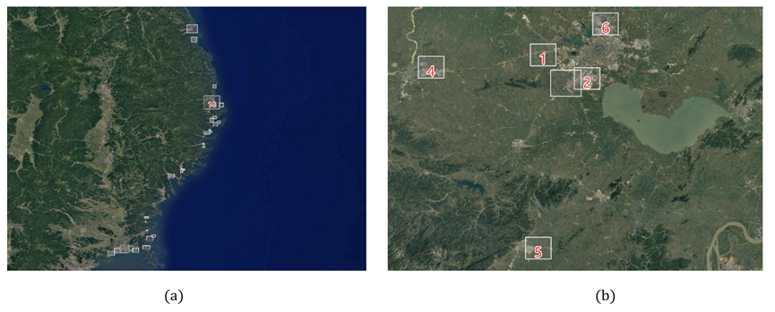

# HFRS-CD

我们的工作提出了一个专注于建筑物变化的遥感图像变化检测数据集（HFRS-CD），所有的原始数据都来自于谷歌地球，我们挑选原始数据中的良好图像对并对其进行精细标注，主要是对于地震海啸之后建筑物的摧毁变化情况以及城市郊区发展的建筑物增加变化情况。该数据集有着和该领域其它公开数据集一样的规模，包含11348个图像对（256×256），同时其(512×512)尺寸版本含有2585个图像对，其中有935对是日本2011年3月11日地震引起的海啸对沿海超过20个地区建筑物的摧毁情况，对应的数据采集地区如图（a）。剩下的为1650对为合肥及周边城市等6个区域5-15年时间区间建筑物变化情况，对应的数据采集如图（b）。同时我们在数据集标注的时候对于一些房屋的阴影部分未进行标注，对于建筑物的边缘进行细微的标注，使得变化与未变化的部分有较为准确的分界。
